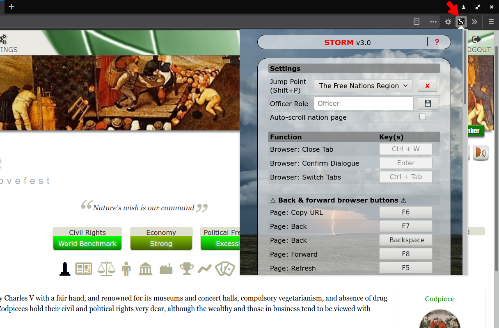

# Storm README

## ABOUT

Storm is an extension for military gameplay on the NationStates website. It makes frequently used actions more convenient by assigning hotkeys to them.

[Firefox add-on](https://addons.mozilla.org/en-US/firefox/addon/storm-ns/versions/) 
[Chrome Extension](https://chrome.google.com/webstore/detail/storm/cjcjjeajapeonoloepkgeifkhogbkjhg)

Storm was originally based on Breeze++ back in 2018, but has since forged its own path. See the keylist and changelog for differences between the two.

| NSBreeze  | [Breeze++](https://chrome.google.com/webstore/detail/breeze%20%20/fmidibfpgbmcmnfedlafdfcbmglbckkf)         | [Storm](https://addons.mozilla.org/en-GB/firefox/addon/storm-ns/)   |
|-----------|----------------------|-------------|
| [Shizensky](http://nationstates.net/Shizensky) | [Vincent W. Drake](https://www.nationstates.net/nation=vincent_drake) | [Krypton Nova](https://www.nationstates.net/nation=krypton_nova) |

#### Changelog

You can find all changes to Storm since it forked from Breeze++ [here](changelog.md).

#### **Contribute / Collaborate:**

All help in making this extension better is welcome! Contact me if you have suggestions, or if you'd like to help with the code (HTML, CSS and pure JavaScript). I'm also open to suggestions for collaboration between similar extensions.

#### **Licence:**
[GNU GPLv3](https://www.gnu.org/licenses/gpl.html)

#### **Contact me:**

Please open an issue if you'd like to see a new functionality added or if something doesn't work as it should.

For other issues: 
[bion@disroot.org](mailto:bion@disroot.org?Subject=Storm) 
David.#4693 on Discord

## Features

Layout for v3.0 and later:

You can change the settings in the addon's popup window:

All shortcuts (except [Enter], [Ctrl]+[W] and [Ctrl]+[Tab]) can be customized. There are shortcuts for the following:

* Page: Copy URL
* Page: Back1
* Page: Forward1
* Page: Refresh

1 With page refresh, so information is up to date and hotkeys are not left disabled. 

* View activity: check if updated, spot, world changes,...
* Banject a nation
* Cross endorse on a nation, also gives visual feedback to show you which nations you still need to endorse
* Open dossier
* Add Nation/Region to dossier
* Endorse a nation
* Jump points: save regions as JP's, manage them & instantly move to your current JP
* Move to a region (instantly from anywhere on NS, or via a region's page)
* View your own nation
* Prepare a switcher (move to JP, apply/leave WA)
* View the region you're in
* Open regional controls, appoint yourself & dismiss officers
* Open reports page
* Go to a nation on either side of a happening in the reports page
* Toggle between unstyled (fast) and default themes
* Apply For & Leave the WA instantly, join WA
* Go to a region's WA Delegate instantly
* Open zombie control
